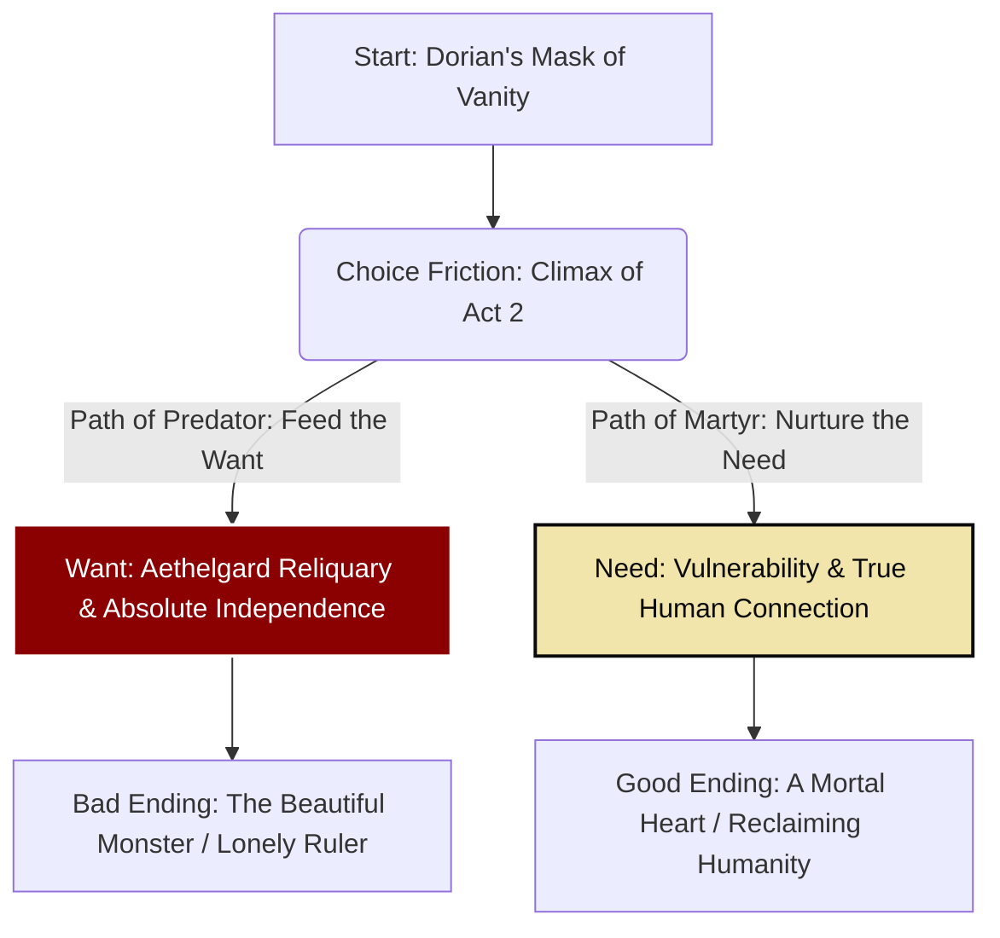

# Master Character & Visual Design: Dorian Vane

> [!NOTE]
> This overall design sheet combines Dorian Vane's psychological narrative profile with his visual composition prompt sheet to serve as the single source of truth for both writing and asset production.

---

## 1. Narrative & Psychological Core

### Identity Details
* **Character Name:** Dorian Vane
* **Apparent Age:** ~25 years (Actual Age: 247 years)
* **Role in Story:** Major Love Interest / Deuteragonist / Magnetic Antagonist (can be aligned based on player choices).
* **High-Concept Vibe:** *"The theatrical, teasing vampire gentleman who hides his ancient loneliness behind elegant vanity and sharp, playful humor, while concealing a lethal, tempting darkness just beneath the surface."*
* **Signature Color Palette:** Crimson Rose (#8B0000) and Obsidian Black (#0B0B0C) with accents of Champagne Gold (#F1E5AC).

---

### The Want vs. Need Engine
This section drives branching player choices and Dorian's character arc.



* **The "Want" (External Goal):** To secure the *Aethelgard Reliquary*, a legendary artifact that can permanently shield a vampire from the elder coven's tracking spells, securing his ultimate freedom.
  * *Details:* Dorian wants to remain a free agent, answerable to no one. He seeks the reliquary to cut ties with the vampire high council, who demand his return to lead a dark crusade. He believes that absolute independence is his only safety, and he will play any game, charm any mark, and lie to anyone to obtain it.
* **The "Need" (Internal Growth):** To drop his charming, mocking facade, confront his profound fear of vulnerability, and accept that a life of isolated vanity is just another cage.
  * *Details:* Dorian needs to learn that true freedom isn't the absence of attachments, but the courage to love and protect someone else, even if it makes him vulnerable to pain. He must learn to trust the protagonist and let them see the "monster" behind the gentleman, rather than running away into comfortable, lonely immortality.
* **The Choice Friction:** Players must choose between protecting Dorian’s human soul or unleashing his terrifying, lethal nature.
  * *Details:* During the climax of Act 2, the protagonist is captured by a rival vampire lord who holds the Reliquary. 
    * **Path of the Predator (Catering to the Want):** The player can urge Dorian to surrender to his bloodlust and slaughter the captors. He easily wipes them out and retrieves the Reliquary (Want), but this unleashes his monstrous, blood-crazed form, pushing him further into the beastly abyss and breaking the trust and humanity he tried so hard to build (violating his Need).
    * **Path of the Martyr (Catering to the Need):** The player can refuse to let Dorian lose his humanity, choosing instead to execute a dangerous, joint escape plan. This forces Dorian to restrain his dark power and rely on the player's mortal plan. While Dorian is severely weakened and injured trying to shield the player (failing his immediate Want of a clean victory), it cements their emotional bond and helps him reclaim his fading human heart (Need).

---

## 2. Visual Outline & Silhouette Anchor
Dorian’s visual assets must instantly communicate a blend of old-world nobility and seductive danger.

* **The Outline Anchor:** A dramatic, ankle-length, high-collared velvet tailcoat draped over his shoulders like a cape, framing a lean, broad-shouldered silhouette that catches the wind dynamically.
* **Key Accessories:**
  * *The Reversed Pocket Watch:* A delicate gold-plated pocket watch with a cracked glass cover. Its hands tick counter-clockwise, symbolizing his frozen time and his lingering attachment to the era of his turning.
  * *The Blood-Fed Rose:* A gold lapel pin in the shape of a rose, clutching a dark red ruby that glows faintly when his thirst increases.
  * *The Crimson Lined Gloves:* Sleek, obsidian-black leather gloves. When he gestures or adjusts his cuffs, the inner lining reveals a vibrant, bloody crimson silk.

---

## 3. Image Generation Prompt Sheet (Visual Composer)
Use these pre-structured, modular prompts in image generators (Midjourney, Stable Diffusion XL) to generate highly consistent sprites for Dorian's expression matrix.

### Visual Concept Reference
Below is the baseline visual novel sprite generated using our **Visual Composer** engine, demonstrating his styling, pose, and color grading:


### Static Prompt Modules
* **[STYLE CANVAS]:** `Visual novel sprite, high-end 2D anime style, clean crisp line art, beautiful soft cell-shading, rich colors, dramatic lighting,`
* **[CHARACTER ANCHOR]:** `a stunningly handsome 25-year-old male vampire aristocrat, sharp elegant jawline, messy silver-white hair swept over his forehead, glowing crimson eyes, wearing an open dark crimson velvet tailcoat with high collar over his shoulders, an obsidian-black vest, gold buttons, champagne-gold necktie, obsidian-black leather gloves with deep crimson silk inner lining, a tiny gold rose pin with a red ruby gem on his left lapel,`
* **[PRODUCTION SUFFIX]:** `waist-up portrait, facing viewer, centered composition, isolated on a solid flat medium-gray background, clean edges, studio light, professional illustration, masterpiece --no 3d, photorealism, background elements, patterns, drop shadows`

---

### Expression Prompt Matrix

````carousel
```text
[1. Baseline / Smug Smirk]
Visual novel sprite, high-end 2D anime style, clean crisp line art, beautiful soft cell-shading, rich colors, dramatic lighting, a stunningly handsome 25-year-old male vampire aristocrat, sharp elegant jawline, messy silver-white hair swept over his forehead, glowing crimson eyes, wearing an open dark crimson velvet tailcoat with high collar over his shoulders, an obsidian-black vest, gold buttons, champagne-gold necktie, obsidian-black leather gloves with deep crimson silk inner lining, a tiny gold rose pin with a red ruby gem on his left lapel, holding a gold pocket watch open in one hand, lazy lopsided smug smirk, one eyebrow elegantly arched, looking directly at the viewer with an amused, vain expression, waist-up portrait, facing viewer, centered composition, isolated on a solid flat medium-gray background, clean edges, studio light, professional illustration, masterpiece --no 3d, photorealism, background elements, patterns, drop shadows
```
<!-- slide -->
```text
[2. Driven / Predator Bloodlust]
Visual novel sprite, high-end 2D anime style, clean crisp line art, beautiful soft cell-shading, rich colors, dramatic lighting, a stunningly handsome 25-year-old male vampire aristocrat, sharp elegant jawline, messy silver-white hair swept over his forehead, glowing crimson eyes, wearing an open dark crimson velvet tailcoat with high collar over his shoulders, an obsidian-black vest, gold buttons, champagne-gold necktie, obsidian-black leather gloves with deep crimson silk inner lining, a tiny gold rose pin with a red ruby gem on his left lapel, mouth slightly parted, sharp white fangs fully exposed, furious cold glare, eyes glowing intensely red, red magic particles faintly shimmering around his gloved hands, waist-up portrait, facing viewer, centered composition, isolated on a solid flat medium-gray background, clean edges, studio light, professional illustration, masterpiece --no 3d, photorealism, background elements, patterns, drop shadows
```
<!-- slide -->
```text
[3. Vulnerable / Soft Truth]
Visual novel sprite, high-end 2D anime style, clean crisp line art, beautiful soft cell-shading, rich colors, dramatic lighting, a stunningly handsome 25-year-old male vampire aristocrat, sharp elegant jawline, messy silver-white hair swept over his forehead, glowing crimson eyes, wearing an open dark crimson velvet tailcoat with high collar over his shoulders, an obsidian-black vest, gold buttons, champagne-gold necktie, obsidian-black leather gloves with deep crimson silk inner lining, a tiny gold rose pin with a red ruby gem on his left lapel, looking downcast, soft sad expression, a gentle gentle sorrowful look, one gloved hand resting lightly on his chest over his lapel rose, lips slightly parted in soft speech, waist-up portrait, facing viewer, centered composition, isolated on a solid flat medium-gray background, clean edges, studio light, professional illustration, masterpiece --no 3d, photorealism, background elements, patterns, drop shadows
```
<!-- slide -->
```text
[4. Shock / Composure Ruined]
Visual novel sprite, high-end 2D anime style, clean crisp line art, beautiful soft cell-shading, rich colors, dramatic lighting, a stunningly handsome 25-year-old male vampire aristocrat, sharp elegant jawline, messy silver-white hair swept over his forehead, glowing crimson eyes, wearing an open dark crimson velvet tailcoat with high collar over his shoulders, an obsidian-black vest, gold buttons, champagne-gold necktie, obsidian-black leather gloves with deep crimson silk inner lining, a tiny gold rose pin with a red ruby gem on his left lapel, eyes wide in genuine disbelief, mouth open in sudden shock, raising one gloved hand in front of his face as if reacting to a sudden surprise, vain composure shattered, waist-up portrait, facing viewer, centered composition, isolated on a solid flat medium-gray background, clean edges, studio light, professional illustration, masterpiece --no 3d, photorealism, background elements, patterns, drop shadows
```
<!-- slide -->
```text
[5. Quirk / Dramatic Sigh]
Visual novel sprite, high-end 2D anime style, clean crisp line art, beautiful soft cell-shading, rich colors, dramatic lighting, a stunningly handsome 25-year-old male vampire aristocrat, sharp elegant jawline, messy silver-white hair swept over his forehead, glowing crimson eyes, wearing an open dark crimson velvet tailcoat with high collar over his shoulders, an obsidian-black vest, gold buttons, champagne-gold necktie, obsidian-black leather gloves with deep crimson silk inner lining, a tiny gold rose pin with a red ruby gem on his left lapel, head tilted back slightly, eyes rolled upward in an exaggerated playful sigh, the back of his gloved left hand dramatically pressed to his forehead in faux-exhaustion, theatrical and comedic body language, waist-up portrait, facing viewer, centered composition, isolated on a solid flat medium-gray background, clean edges, studio light, professional illustration, masterpiece --no 3d, photorealism, background elements, patterns, drop shadows
```
````

---

## 4. Writer's Playbook: Tone & Behavior

### Key Behavioral Quirks
1. **The Tease:** Whenever he is hiding an emotion or dodging a direct question, he will pull out his pocket watch, pop the lid open, and stare at the reversing hands, offering a witty philosophical remark about "mortal impatience."
2. **The Predator’s Habit:** When he is tempted—either by blood, danger, or attraction—he will slowly pull the cuff of his left glove with his teeth to adjust it, his gaze locked onto the protagonist.
3. **The Gentleman’s Bow:** He performs a theatrical, sweeping low bow to defuse tense situations, keeping one hand on his chest and his eyes pinned to the player, turning a gesture of respect into a playful challenge.

### Dialogue Showcase
| Emotion | Dialogue Sample |
| :--- | :--- |
| **Default / Playful** | *"My, my... what a delightfully chaotic mind you have. Tell me, darling, do you always walk into a lion's den with nothing but a sharp tongue and a pretty smile? Or am I just exceptionally lucky tonight?"* |
| **Deflecting** | *(Sighs dramatically, back of hand to forehead)* *"You wound me! Here I am, offering you the finest vintage of my private collection—yes, grape juice, don't look at me like that—and you accuse me of having a 'sinister agenda.' I am a gentleman, my dear. If I were going to ruin your life, I would at least have the decency to write a ballad about it first."* |
| **Dangerous / Seductive** | *(Steps closer, adjusting his glove)* *"You play with fire and call it curiosity. Tell me... do you know what happens when you stand this close to a predator? I could take your breath away in a heartbeat, and you would thank me for the privilege. So tell me, little bird... are you truly brave, or just beautifully foolish?"* |
| **Vulnerable / Honest** | *(Looking down, holding the pocket watch)* *"For two hundred years, the world moved, and I stood still. It was easy. Safe. Nothing could hurt a ghost who laughed at his own haunting. But you... you make me want to step back into the sun. Even if it burns me to ash."* |

---

## 5. Visual Arcs (Endings)

### Bad Ending: "The Beautiful Monster"
* *Narrative:* If he is pushed to prioritize power and self-preservation, he ascends to lead the High Council, discarding his human emotions and warmth. He treats the protagonist as an exquisite pet rather than an equal.
* *Visual Drift:* 
  * Replaces his gold-lined, colorful tailcoat with an armor-like, pitch-black high-collar military double-breasted suit (no gold accents).
  * His eyes glow a permanent, flat crimson; he no longer smirks or wears a playful expression.

### Good Ending: "A Mortal Heart"
* *Narrative:* If he chooses vulnerability, he relinquishes his claim to the Reliquary and severs his ties to the high coven, choosing to live out a fragile, meaningful mortal life alongside the protagonist.
* *Visual Drift:* 
  * Discards his velvet tailcoat, pocket watch, and gloves entirely. 
  * Wears a simple, cream-colored linen shirt with rolled-up sleeves.
  * His eyes lose their glowing red color, turning into a warm hazel, and he smiles with genuine, soft warmth.
